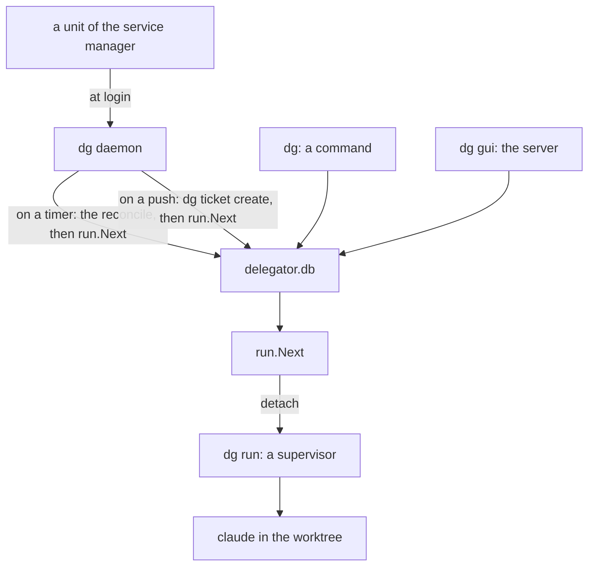

# Delegator: when a daemon makes sense

**Condition:** draft, for your examination
**Date:** 2026-09-10
**Companion to:** [`TECHNICAL_DESIGN.md`](TECHNICAL_DESIGN.md) and [`RUN_CONTROL.md`](RUN_CONTROL.md)
**Language:** ASD-STE100 Simplified Technical English, Issue 9.

You asked one question: in what case does a daemon make sense? Section 3.2 of the run
control document examined a long-life program for the tickets of that day, and refused
it. That answer was for those tickets. This document gives the conditions that change
the answer, what each condition costs, and what delegator can do instead of a daemon
for each one. Section 6 gives the shape of the daemon, if one comes, so that the first
decision about it does not become rework.

## 0. Technical names

Section 0 of the technical document declares the technical names, and section 0 of the
run control document adds the trigger and the slot. This document uses them, and adds
these:

| Technical name | What it is in this document |
|---|---|
| daemon | A program that starts at login or at boot, and lives until the computer stops. It is the long-life program of section 3.2 of the run control document. |
| event | A thing that occurs with no command from the person. Examples: a run ends, a timer expires, a message arrives from the network. |
| gap | The time in which no program of delegator is alive. The person is away, and no run is active. |
| poll | A read of a source at an interval, to find whether the source has new data. |
| push | A message that a source sends when it has new data. A push needs a program that listens at that moment. |
| service manager | The program of the operating system that starts a unit. It is systemd on Linux and launchd on macOS. |
| timer | A unit that starts a program at a time, or at an interval. |
| unit | The file that tells the service manager what to start, and when. |
| webhook | A push from a source on the network, such as GitHub. It arrives on a port. |

## 1. Summary

Delegator has no daemon. Each program of delegator is short: a command that a person
types, or a supervisor that a trigger starts and that stops with its run. This shape
answers lesson 1 and lesson 7 of the technical document, and section 5 of that document
gives the reason.

A daemon does one thing that no other shape does. It acts in the gap. Today nothing acts
in the gap, and delegator accepts this because of principle 2: the person goes away and
comes back to a command. That command does the reconcile and starts the queue.

A daemon therefore makes sense only when delegator must act in the gap. Section 3 gives
the six conditions in which that is true. For five of them, a short program from the
service manager does the work, and no daemon is necessary. One condition has no other
answer, and it is a push from the network. Section 7 gives the recommendation: no daemon
now, a unit at login first, a timer second, and a daemon only when a push arrives or
the units become too many.

## 2. Who acts, and when

The table below gives each condition of the computer, the program that is alive, and
the work that it does. The last two rows are the gap.

| Condition | Alive | Who acts |
|---|---|---|
| The person types a command | The command | The reconcile, then `run.Next`, then the work of the command. |
| A run is active | The supervisor | The timeout, the write of the state, then `run.Next` for the next ticket. |
| The person is away, and no run is active | Nothing | Nobody. The queue is empty, or it is paused, or a supervisor died with no report. |
| The computer restarted | Nothing | Nobody, until the next command of the person. |

Two of the four rows have a program that acts. Each function that delegator has today
lives in one of those two rows. The reconcile lives in a command. The timeout and the
start of the next ticket live in the supervisor. The design put each function in the
program that is alive at the moment the function is necessary.

A new function goes into one of those two programs, if a program is alive at its moment.
A daemon is necessary only for a function whose moment is in the gap. That is the test
that each condition of section 3 must pass.

## 3. The conditions

Each condition below is a function whose moment can be in the gap. For each one, the
table gives what the function is, what answers it with no daemon, and the signal that
shows that the answer is not enough.

### 3.1 The queue must continue through a restart of the computer

After a restart, no supervisor is alive, and the tickets of the dead runs stay in
`running`. The next command of the person does the reconcile, marks each dead run
`failed`, and starts the next ticket. A person who is away for the night comes back to
a queue that stopped at the restart.

| Item | What it is |
|---|---|
| Without a daemon | A unit at login that runs `dg queue start`. The command does the reconcile, starts the queue, and stops. Section 10 of [`FEATURES.md`](FEATURES.md) holds this item. |
| What it costs | The installer must put one unit on the computer. A person who installs with `curl` does not get it, and must make it by hand. |
| What a daemon adds | Nothing. The daemon does the same work at its start, and then waits for the next event. |
| The signal for a daemon | None. The unit at login is the complete answer. |

### 3.2 A run that goes above the timeout after its supervisor died

The supervisor applies the timeout to its own run. If the supervisor dies, nothing
applies it. The reconcile of the next command marks the run `failed` because of its
age, so the run is correct at that command. Before that command, the ticket stays in
`running` and holds its slot.

| Item | What it is |
|---|---|
| Without a daemon | A timer that runs `dg` each few minutes. The command does the reconcile and stops. The output goes nowhere, and the reconcile is its only effect. |
| What it costs | One more unit. The reconcile does not exist yet, so the timer waits for ticket 17. |
| What a daemon adds | The operating system tells a parent when its child stops. A daemon that holds each run as its child knows the moment the run dies, and not the moment the timer expires. Section 5 says why the daemon must not hold a run as its child. A daemon that is a trigger does the same reconcile on a timer, as the unit does. |
| The signal for a daemon | None. A slot that is held for a few minutes costs nothing that a person can see. |

### 3.3 A schedule

A person can want the queue to run at night only, or a ticket to start at a time.
Nothing in delegator today reads a clock for this.

| Item | What it is |
|---|---|
| Without a daemon | A timer that runs `dg queue start` at one time and `dg queue pause` at a different time. The commands exist. A person who wants one ticket at a time puts it at the top of the queue and starts the queue with the timer. |
| What it costs | Two units, or one line in the crontab of the person. |
| What a daemon adds | A schedule inside the config, which a person edits in one place. |
| The signal for a daemon | A person asks for a schedule on a system that has no timer and no cron, such as a container. |

### 3.4 A message to the person when a run ends

Principle 2 says that the person comes back to the inbox. A person can also want a
message on the desktop, or in a chat program, at the moment a run ends.

| Item | What it is |
|---|---|
| Without a daemon | The supervisor. It is alive at the moment the run ends. It can start one command of the person, as `dg open` starts a command in a new window. The person selects the command in the config, and delegator does not know what it does. |
| What it costs | One value in the config, and one call in the supervisor. |
| What a daemon adds | Nothing. The moment of this function is not in the gap. |
| The signal for a daemon | None. |

### 3.5 An input from outside

Section 11 of [`FEATURES.md`](FEATURES.md) puts input from GitHub, from JIRA, from a
webhook or from a schedule in the parent product. A source of tickets that is not the
person is the one condition in which the moment of the function is in the gap and no
short program can hold it.

Two forms of input exist, and they are different. A poll is a read at an interval. A
push is a message that arrives at a moment that the source selects.

| Item | What it is |
|---|---|
| Without a daemon | A poll. A timer runs `dg pull`, a command that reads the source, makes a ticket for each new item, and stops. The command does not exist today. |
| What it costs | One unit, one command, and the delay of the interval. A poll each 5 minutes gives a ticket up to 5 minutes after the source made it. |
| What a daemon adds | A push. The daemon listens on a port, and the ticket exists at the moment the message arrives. A push from GitHub must reach the computer from the internet, which a port on the loopback does not permit. That needs a public address or a tunnel, and section 11 of the technical document says that Delegator has no inbound network interface. |
| The signal for a daemon | A source that pushes and that cannot be polled, or a person for whom the delay of the poll is a problem. Both belong to the parent product today. |

### 3.6 A page that is always open

Section 3 of [`GUI.md`](GUI.md) says that the server of `dg gui` lives while the
person looks at the page, and stops with Ctrl-C. A person who opens the page many times
a day starts the server many times a day, and the port changes each time.

| Item | What it is |
|---|---|
| Without a daemon | A unit at login that runs `dg gui --port 7000 --no-browser`. The server is then alive from login, at one address. It is a daemon in its life, but not in its function: it starts no run of its own, and holds no state. Section 3 of the GUI document keeps it out of the path of the queue. |
| What it costs | One unit, and one fixed port. |
| What a daemon adds | Nothing that the unit does not give. |
| The signal for a daemon | None. A page that is always open is `dg gui` with a unit, and the rules of the GUI document stay true for it. |

### 3.7 What the conditions have in common

Five of the six conditions have the same answer: a unit of the service manager that runs
a short `dg` command at login or on a timer. The service manager is the daemon of the
operating system. It is already alive, it already starts at boot, and the person who
installed it already controls its life. A unit gives delegator the one thing a daemon
gives, which is a program in the gap, and delegator writes no code for the life of that
program.

The one condition that a unit cannot answer is the push of section 3.5. A push needs a
program that listens at the moment of the message. A timer starts a program at a moment
that the timer selects, and the two moments are not the same.

## 4. What a daemon costs

Section 3.2 of the run control document gives the costs, and this section repeats them
here so that the document is complete.

| Cost | What it is |
|---|---|
| Its own life | A daemon has the problem of P1 one level up. Is the daemon alive, who starts it at boot, and what stops it? The service manager answers this for a unit, and delegator answers it for nothing today. |
| The installation | The installer must put a unit for systemd and a plist for launchd on the computer. A person who installs with `curl` gets neither. A container has no service manager. |
| The two lessons | Lesson 1 and lesson 7 came from a long-life program. The MCP server lived inside the queue worker, and `queue down` released a lock while a run continued. Section 5 gives the rules that keep the two lessons answered. |
| The tests | Each integration test must start and stop the daemon, which makes it slower and less independent. |
| The port | A daemon that listens for a push has a port. Section 11 of the technical document says that delegator has no port, and that sentence becomes false. Section 7 of the GUI document gives the defence for a port on the loopback, and a push from the internet needs more. |
| A second path | A person types `dg queue start`, and the daemon also starts the queue. The two must not disagree. They do not, because each calls the same function on the same database, and the claim is in the supervisor. |

The last row is the reason that a daemon costs less today than it did when section 3.2
of the run control document refused it. That section had the claim in the trigger, so
two triggers could compete. Ticket 21 put the claim in the supervisor. A daemon that
calls `run.Next` on a timer is then one more trigger, and a second trigger at the same
moment does no harm: two supervisors start, and the second one finds no room and stops.

## 5. What a daemon must not be

The prototype had a daemon, and lesson 1 and lesson 7 came from it. Both lessons came
from one property: the daemon held something that a run needed. The MCP server held the
tools of the agent, and the lock held the right to the worktree. When the daemon
stopped, the run lost what the daemon held.

A daemon for delegator must hold nothing that a run needs. The list below gives each
thing that a daemon must not hold.

1. **A run.** The daemon does not start the agent, and it is not the parent of a
   supervisor. It calls `run.Next`, which starts a supervisor with `detach`, in a
   session of its own. The supervisor lives after the daemon stops.
2. **A lock.** The daemon holds no lock on the queue and no lock on a worktree. The
   database controls each write, as it does for a command.
3. **A connection.** The daemon opens the store for each event with `store.With`, does
   the work, and closes it. It holds no connection between two events, so a `dg`
   command and the daemon share the database as two commands do now.
4. **A tool of the agent.** The agent uses the CLI, and the CLI does not need the daemon.
   An agent whose daemon stopped has each tool that it had before.
5. **State.** Each fact is in the database. A daemon that stops loses nothing, and a
   daemon that starts reads the database and continues.

A daemon that obeys the five rules is the fourth interface on one database, with the
CLI, the supervisor and the GUI. It is not the daemon of the prototype.

## 6. The shape, if a daemon comes

This section gives the shape so that the first version is small and obeys section 5.

| Item | Behaviour |
|---|---|
| The command | `dg daemon`. It is hidden from `dg help`, as `dg run` is, because the unit starts it and a person does not. |
| The loop | The daemon waits for an event. An event is the timer, or a push on the port. For each event it opens the store, does the reconcile, does the work of the event, calls `run.Next`, and closes the store. |
| The timer | One interval in the config, with a default of 1 minute. Each tick is the same reconcile that each command does. |
| The port | Only if a push exists. The daemon listens on the loopback, with a token, as the GUI does. A push from the internet is the work of a tunnel that the person selects, and not of delegator. |
| Two daemons | Possible, and not a fault. Two calls to `run.Next` at one moment start two supervisors, and the second one stops. The service manager starts one instance of a unit in each case. |
| The stop | The daemon stops on `SIGTERM`, and writes nothing at the stop. Each run continues, because the daemon holds none. |
| The install | A command `dg service install` writes the unit for the service manager of the computer, and `dg service remove` removes it. Each command knows the name of the operating system, as the start of the browser does in the GUI document. |

The first version is the timer alone. The timer gives the reconcile in the gap, which
is section 3.2, and the restart of the queue at login, which is section 3.1. The port
comes with the first push, and not before it.

## 7. Recommendation

1. **No daemon now.** None of the six conditions has occurred. The one condition with
   no other answer, the push, belongs to the parent product.
2. **A unit at login is the first step.** It answers section 3.1, and it is already in
   section 10 of [`FEATURES.md`](FEATURES.md). It starts when a restart of the
   computer with no person at it stops the queue.
3. **A timer is the second step.** It answers section 3.2 and section 3.3. It starts
   when a person asks for a schedule, or when a held slot becomes a problem that a
   person can see.
4. **A daemon is the third step.** It starts on one of two signals. The first is a push
   that must reach delegator, and that a poll cannot replace. The second is a count of
   units that is too many for the installer to place, at about three, because one
   daemon then replaces each of them.
5. **The daemon is a trigger and not a parent.** When it comes, it obeys the five rules
   of section 5, and it has the shape of section 6.

### 7.1 Changes to the documents

- `FEATURES.md`, section 10: one row for the timer, and one row for the daemon, each
  with the trigger above.
- `DECISIONS.md`: one row, when the daemon comes, that says it is a trigger and not a
  parent.
- Section 11 of the technical document changes when the daemon gets a port, and not
  before.
