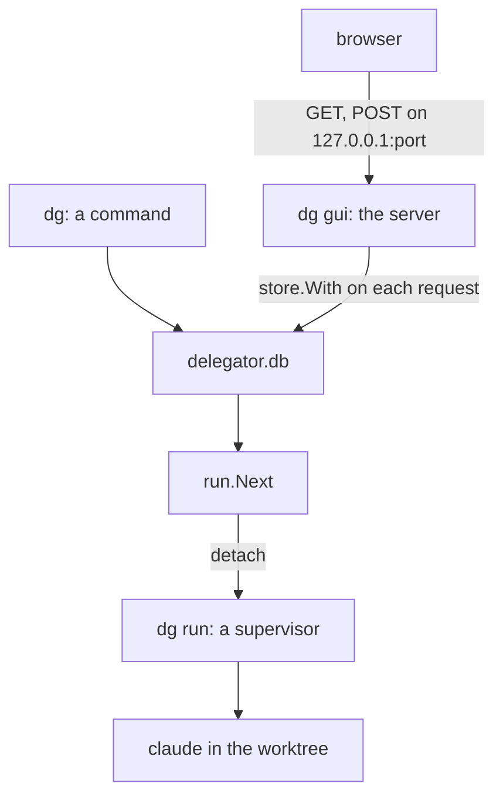

# Delegator: a GUI in the browser

**Condition:** deprecated on 2026-09-11. Do not do the plan of section 9.
**Date:** 2026-09-09
**Companion to:** [`TECHNICAL_DESIGN.md`](TECHNICAL_DESIGN.md)
**Language:** ASD-STE100 Simplified Technical English, Issue 9.

**Why this document is deprecated.** The GUI is a desktop program, made with
Electron, that a person buys. The CLI stays free, and it is the contract: the
desktop program starts `dg` for each read and each write, and reads the JSON that
`--json` gives. A server in `dg` puts a GUI in the free binary, and it adds a port
and a token. The roadmap is outside the repository, at
`~/notes/20-29 Projects/Alcubi/delegator/Roadmap/Desktop GUI.md`. Sections 3, 5
and 7 of this document stay as a record of what was examined.

You asked one question: what is the effect if delegator gets a GUI? The command
`dg --gui` starts a server on a port, and opens the browser at it. This document
gives the effect on the architecture, on the code, on the security, and on the
documents. Section 9 gives the plan as a list of commits.

## 0. Technical names

Section 0 of the technical document declares the technical names, and this document
uses them. It adds these:

| Technical name | What it is in this document |
|---|---|
| browser | The program on the computer of the person that shows a page. |
| cookie | A value that the browser sends with each request to one server. |
| form | The part of a page that sends a request when the person clicks a button. |
| GUI | Graphical User Interface. In this document, the pages that `dg gui` serves. |
| handler | The function in `dg` that answers one request. |
| loopback | The network interface that only programs on the same computer can reach. Its address is `127.0.0.1`. |
| origin | The scheme, the host and the port of the page that sent a request. The browser puts it in the header `Origin`. |
| page | One HTML document that the browser shows. |
| port | The number on which the server listens. |
| request | One message from the browser to the server. A request is a GET or a POST. |
| server | The part of `dg gui` that listens on the port and answers each request. |
| template | A file that holds the HTML of a page, with a place for each value. |
| token | A random value that `dg gui` makes at its start, and that each request must carry. |

## 1. Summary

The GUI is possible with no new library. `net/http`, `html/template` and `embed` are in
the standard library of Go, so `go.mod` does not change. The binary grows by about
8 MB. Section 6 gives the number.

The GUI is not a long-life program in the path of the queue. Each run is a supervisor
that operates apart from the server, as it operates apart from a command today. A
person who stops the server stops no run. Lesson 1 and lesson 7 of the technical
document stay answered. Section 3 gives the rules.

The seam for a second interface exists for reads, and not for writes. The package
`internal/inbox` gives the inbox as data with no text, as section 12 of the technical
document asks. The work of `dg accept`, `dg move`, `dg pause` and `dg start` is inside
the cobra function of each command, and no second caller can reach it. Step 1 of the
plan moves that work out, as a refactor with no change of behaviour.

Section 11 of the technical document says that delegator has no server and no port.
That sentence is no longer true after this work. The server listens on the loopback
only, while `dg gui` runs, and a token gives it protection. Section 7 gives the threats and the
defence.

Each command that arrives after the GUI lands twice: as a cobra command, and as a
handler with a form. Section 9 gives the rule.

The request said `dg --gui`. The plan uses `dg gui`, and section 10 says why.

## 2. What the person gets

The person opens one page and sees the inbox, with the same four groups and the same
order as `dg`. The duration of a run counts up on the page. A click on a ticket shows
what `dg show` shows: the commit, the four variables, and the prose. A button does
what a command does: accept, move, pause and start. A form makes a ticket.

The GUI shows no output of the agent. Principle 4 of the technical document applies to
each interface: the person sees the ticket, the commit and the variables.

`watch -n 1 dg` gives the first of these today. The page adds the click from a row to
the ticket, the button in place of the id that a person types, and a form in place of
`$EDITOR`.

## 3. Where the server goes in the architecture

The technical document has no long-life program, and section 5 gives the reason:
lesson 1 and lesson 7 both came from one. The server is a program that lives while
the person looks at the page. These rules keep it out of the path of the queue.



1. **The server is a reader and a writer of the database, as a command is.** Each
   handler calls the function that the command calls. It opens the store with
   `store.With`, does the work, and closes it. The server holds no connection between
   two requests, so a `dg` command at the terminal and the server share the database
   the way two commands do now, with WAL and `busy_timeout`.
2. **The server starts no run of its own.** A handler that makes a ticket or accepts
   one calls `run.Next`, as the command does. `run.Next` starts a supervisor with
   `detach`, in a session of its own. The supervisor lives after the server
   stops.
3. **A server that stops loses nothing.** The page goes away, and the person starts
   `dg gui` again. No run, no ticket and no state is in the server.
4. **Two servers are possible.** Each `dg gui` takes its own port. No lock is
   necessary, because the database controls each write.
5. **The reconcile runs on each request.** Ticket 17 gives each command a reconcile
   before its work. The handler calls the same function, so a page that a person
   opens after a crash of a supervisor shows the ticket as `failed`, as `dg` does.

The server is then the third interface on one database, with the CLI and the
supervisor. It is not the daemon that section 3.2 of [`RUN_CONTROL.md`](RUN_CONTROL.md)
examined and refused.

## 4. The command

```
dg gui [--port <n>] [--no-browser]
```

| Item | Behaviour |
|---|---|
| The address | The server listens on `127.0.0.1` only. It never listens on each interface. |
| `--port` | The port. The default is 0, and the system then gives a free port. |
| The URL | The command writes the URL on the terminal, with the token in it. |
| The browser | The command starts `xdg-open <url>` on Linux and `open <url>` on macOS. |
| `--no-browser` | The command writes the URL and starts no browser. A person at an SSH session uses this. |
| A browser that fails | The command writes the error and continues. The URL is on the terminal. |
| The stop | Ctrl-C stops the server. The command writes nothing to the database at the stop. |

The start of the browser is the one program that `dg gui` starts, and the one place
that knows the name of the operating system. The command `dg open` of section 9.2 of
the technical document does not exist yet, so the GUI cannot use it.

## 5. The pages

The pages come from `html/template`. The templates and one CSS file go into the binary
with `embed`, so a release is one file, as it is now. There is no build step, no
JavaScript library and no CSS library.

| Page | Shows | Reads |
|---|---|---|
| `GET /` | The inbox: the status line, and the four groups in the order of `dg`. Each row is a link to the ticket. | `inbox.Get`, as `dg` does. |
| `GET /ticket/<id>` | One ticket: the title, the status, the time, the commit, the four variables and the prose. The buttons for the state of the ticket. | The data that `showTicket` reads. See section 6. |
| `GET /ticket/new` | The form for a ticket: the title, the prose, and the project. | `store.Projects`. |

| Action | Does | Calls |
|---|---|---|
| `POST /ticket` | Makes a ticket and starts the queue. | `cli.Ticket` and `run.Next`. |
| `POST /ticket/<id>/accept` | Closes a ready ticket and removes the worktree. | The work of `dg accept`. |
| `POST /ticket/<id>/move` | Moves a ticket in the queue. The form gives `up`, `down`, `top`, `bottom` or the id of a target. | The work of `dg move`. |
| `POST /pause` and `POST /start` | Stops or starts the queue. | The work of `dg pause` and `dg start`. |

Each POST does the work, and then sends the browser to the page that it came from. A
page that a person then reloads does not do the work again.

`dg finish` has no form. It is the command of the agent, and a person who finishes a
ticket by hand types the command. `dg run` has no form, because it is hidden from
`dg help` for the same reason.

**The project of a new ticket.** `dg ticket` takes the project from the directory that
the person is in. The server has no such directory: the person started it in one
directory, and the ticket can be for a different project. The form gives a
list of each project in the database, and a field for the path of a project that is
not in it. The inbox is one list for all projects, and the form obeys the same
principle.

**The refresh.** The duration of a run changes each second. A small script on the
inbox page gets `/` again each 2 seconds, and puts the new list in place of the old
one. The script does not reload the page, because a reload moves the scroll and
empties a form. The ticket page does the same for the time. There is no WebSocket and
no server-sent event, because a poll of one SQLite query each 2 seconds costs nothing
that a person can see.

**What the GUI does not show.** The output of the agent, the log, and the session.
Section 6.4 of the technical document gives the reason, and the GUI does not change it.
The session id is on the page, so the person can open it with the agent.

## 6. Effect on the code

The binary grows by about 8 MB. A build of `dg` today is 11.6 MB, and a build with
`net/http`, `html/template` and `embed` is 19.9 MB, with `CGO_ENABLED=0`. Most of
the growth is `crypto/tls` and the certificates, which `net/http` includes and which a
server on the loopback does not use. Go gives no way to leave them out. Section 12 of
the technical document says that the binary must stay small, and it put a GUI in Go
into a second binary for that reason. The number is below, and you decide.

| Binary | Size |
|---|---|
| `dg` today | 11.6 MB |
| `dg` with the server | 19.9 MB |

The table below gives each package and its change.

| Package | Change |
|---|---|
| `internal/cli` | The work of `dg accept`, `dg move`, `dg pause` and `dg start` moves out of the cobra function. Each becomes one exported function: `Accept`, `Move`, `Pause` and `Start`. `Ticket` is exported today. The variable `launch` becomes `Launch`, so a test of the GUI can put a program it can observe in its place. The function `showTicket` reads five things and writes text; it becomes one function that returns a struct and one that writes it. |
| `internal/inbox` | No change. |
| `internal/store` | No change. `Projects` exists for the form. |
| `internal/gui` | New. The server, the token, the start of the browser, one handler for each page and each action, the templates and the CSS. About 600 lines of Go and about 200 lines of templates. |
| `cmd/dg` | Adds the command `gui` to the tree that `cli.Root` returns. |
| `CLAUDE.md` | One line for `internal/gui` in the layout. |

**The direction of the imports.** `internal/gui` imports `internal/cli` for the work
of each command. `internal/cli` does not import `internal/gui`, so there is no cycle,
and `cmd/dg` connects the two. The test in `internal/cli` that walks the tree does not
see `gui`, and that is correct: `gui` is not one of the commands that `internal/cli`
holds.

A different shape is possible: a package below both, which holds the work of each
command, and which `cli` and `gui` both import. It moves each command for a caller that
can import `cli` as it is. Do it when a third interface arrives, and not now.

**The launcher.** The tests section of `CLAUDE.md` says that a launch which defaults to
`os.Executable` starts the test binary, which starts more of them. The tests of
`internal/gui` call `cli.Accept` and `cli.Ticket`, which call `run.Next` with the
launcher. `TestMain` of `internal/gui` sets `cli.Launch` to a no-op, as
`TestMain` of `internal/cli` does today. This is the reason that `launch` becomes
exported.

**The tests.** The handlers take a `store.Store` and a writer, and `httptest` drives
them with no port. The fixtures in `internal/testfix` serve as they serve `internal/cli`.
The coverage floor of `make check` is 70 percent over `./internal/...`, so a new
package with no test lowers the total and stops the commit. The first commit of
`internal/gui` holds its tests for that reason.

**The Makefile.** No change. `make install` puts `dg` on the PATH, and `dg gui` starts
the server.

## 7. Security

Section 11 of the technical document says: "Delegator has no server, no port and no
token. There is no network interface." After this work the sentence becomes:
"Delegator has no server that lives after a command. `dg gui` listens on the loopback
while it runs, and a token gives it protection."

The loopback is not private. Each program on the computer can reach it, and that
includes each page in the browser of the person. A page on any site can send a POST to
`http://127.0.0.1:<port>/ticket`. The ticket then goes to an agent that operates with
its permission questions off, in a repository of the person. The prose of that ticket
is the instruction of the agent. This is the one threat that makes the token
necessary, and the prototype cannot leave it out.

| Threat | What occurs | Defence |
|---|---|---|
| A page on a different site sends a request. | The page makes a ticket, accepts one, or moves the queue. | The token. `dg gui` makes 32 random bytes at its start and puts them in the URL that it opens. The first request sets a cookie with the token, and each request after it must carry the cookie. A request with no token or a wrong token gets `403` and no data. |
| A page on a different site sends a POST from a form. | The browser sends the cookie with a form from any site. | Each POST must carry the header `Origin`, and the origin must be the address of the server. A POST with a different origin or no origin gets `403`. |
| A site makes its name resolve to `127.0.0.1`. | The page of that site reads the inbox with the cookie of the person. | Each request must carry the header `Host` with the address of the server. A different host gets `421`. |
| A different user on the computer connects to the port. | That user reads the tickets of the person. | The token. The loopback is open to each user, so the token is the one wall. The URL on the terminal is the one copy of it. |
| The prose of a ticket holds HTML or a script. | The page runs it. | `html/template` escapes each value, and the pages hold no place that does not. |

The server has no TLS. A connection on the loopback does not leave the computer, and a
certificate for `127.0.0.1` is a question that no person wants at a first start.

Delegator writes the token nowhere. It is in the memory of the server, on the terminal,
and in the browser. A stop of the server ends it.

## 8. Effect on the documents

| Document | Change |
|---|---|
| `TECHNICAL_DESIGN.md` §4 | "A web interface" is in the list that is not in scope. It comes out, or it says that the interface is local. |
| `TECHNICAL_DESIGN.md` §9.3 | One row for `dg gui`. |
| `TECHNICAL_DESIGN.md` §11 | The first line changes, as section 7 above says. One line for the token. |
| `TECHNICAL_DESIGN.md` §12 | "A GUI in Go becomes a second binary" changes. A GUI in the browser needs no graphical library, and it is in `dg`. The number of section 6 goes there. |
| `FEATURES.md` §1 | The row for the GUI changes or goes. The row for the TUI needs your answer to question 2. |
| `DECISIONS.md` | Two rows: the GUI is a server in `dg` on the loopback, and a token with the origin and the host gives it protection. |
| `CLAUDE.md` | One line for `internal/gui`. |

## 9. The plan

Each step is one commit or a small group of commits, and `make check` is green after
each one. A refactor and a change of behaviour are in different commits, and the
tests of a refactor do not change.

| Step | What it does | Type |
|---|---|---|
| 1 | Export `Accept`, `Move`, `Pause` and `Start` from `internal/cli`, and rename `launch` to `Launch`. The tests do not change. | Refactor |
| 2 | Split `showTicket` into the read of the data and the write of the text. The tests do not change. | Refactor |
| 3 | Add `dg gui` with the inbox page only. The listen, the token, the origin, the host, the browser and the two flags. Tests with `httptest`. | Behaviour |
| 4 | Add the ticket page. | Behaviour |
| 5 | Add the refresh script to the two pages. | Behaviour |
| 6 | Add the form for a ticket, with the list of projects. | Behaviour |
| 7 | Add the buttons: accept, move, pause and start. | Behaviour |
| 8 | Change the documents as section 8 says, and add the line to `CLAUDE.md`. | Documents |

Step 3 is the largest, and it is the one that makes the shape. Steps 4 to 7 each add
one handler and one part of a template.

**The rule after the plan.** Each command that arrives after step 7 lands with its
handler and its form in the same ticket. The commands `dg cancel`, `dg restart`,
`dg revise` and `dg open` are in the technical document and not in the code, and each
one gets a button. A command that lands in the CLI alone makes the two interfaces come
apart, and a person then finds a command that the page does not have.

**The size of the work.** `FEATURES.md` says that the TUI was about 40 percent of the
work of version 1. The GUI is of that size, because it has the same pages and the same
actions. The refresh, the form, the token and the tests are the parts that the TUI does
not have. The keys of the TUI are the parts that the GUI does not have.

## 10. Questions for you

1. **`dg gui` or `dg --gui`?** The plan uses a subcommand. The root command has
   `Args: cobra.NoArgs` and shows the inbox, and a flag on it puts `--port` and
   `--no-browser` on each command, where they mean nothing. A subcommand gets its own
   flags, its line in `dg help`, and its completion, with no code. The default is
   `dg gui`.
2. **Does the GUI take the place of the TUI?** `FEATURES.md` gives the TUI one trigger:
   READY has more than about 20 tickets, and `dg` is difficult to scan. The GUI answers
   the same trigger. One second interface costs less than two, and each command lands
   twice and not three times. The default is that the GUI takes the place of the TUI,
   and the row of the TUI in `FEATURES.md` says so.
3. **Is the size of the binary satisfactory?** The server adds about 8 MB, and section 12
   of the technical document asks for a small binary. The default is to keep the one binary. A
   second binary `dg-gui` keeps `dg` small, and it costs a second program to install,
   a second `PATH` entry, and a second place for `cli.Launch`.
