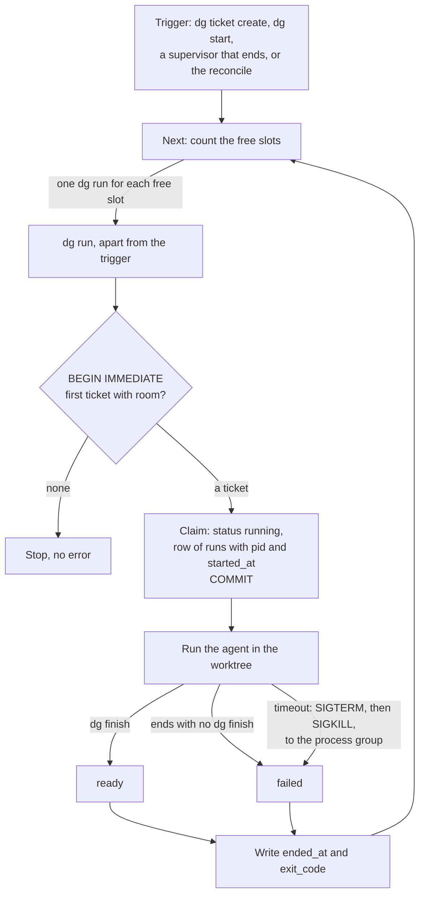
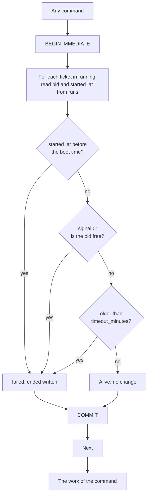
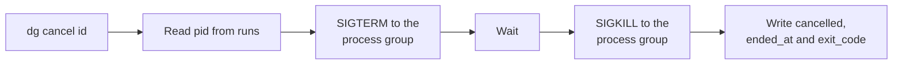

# Delegator: the control of runs

**Condition:** draft, for your examination
**Date:** 2026-09-03
**Companion to:** [`TECHNICAL_DESIGN.md`](TECHNICAL_DESIGN.md)
**Language:** ASD-STE100 Simplified Technical English, Issue 9.

Ticket 17 asks one question: how does a command know that a supervisor is alive? The
question is small, but five later tickets and three sections of the technical document
need the same answer, or an answer that agrees with it. This document examines all of
them together, so that the first decision does not become rework for the next one.

## 0. Technical names

Section 0 of the technical document declares the technical names, and this document uses
them. It adds these:

| Technical name | What it is in this document |
|---|---|
| boot time | The time at which the operating system started. |
| file lock | An advisory lock on a file, which `flock` gives. It is not the lock, which is the write lock of SQLite. |
| process id | The number that the operating system gives to one program while it runs. |
| process group | The set of programs that one signal can reach together. A supervisor makes its own group. |
| signal | A message from the operating system to a program, such as `SIGTERM` or `SIGKILL`. |
| slot | One of the `runs` places from the config. A ticket in `running` takes one slot, and a ticket in `ready` also takes one. |
| start window | The short time between the claim of a ticket and the moment that its supervisor can answer for itself. |
| trigger | A command or a supervisor that can start a run. Today `dg ticket create`, `dg start`, and a supervisor that ends. |

## 1. The problems

Six problems share one area, which is the control of a program that delegator does not
watch. Each later problem depends on an answer to an earlier one.

**P1. Is a supervisor alive?** A supervisor can stop with no report: a crash, a signal
from the person, or a restart of the computer. Its ticket then stays in `running`. Only a
later command can correct this, and that command must know whether the supervisor is
there. Ticket 17 asks this. Section 5 and section 6.1 give the reconcile this work.

**P2. Which program holds a run?** Two future tickets must find the program. Ticket 26
must stop the run of a ticket, so it must reach the agent. Ticket 21 must tell a ticket
that `Next` claimed for this supervisor from a ticket that a different supervisor holds.
The table `tickets` has no column for a program.

**P3. How does delegator stop a run?** Two functions stop a run: `dg cancel` from ticket
26, and the timeout from section 6.3. The timeout has no ticket. The agent starts programs
of its own, and a stop that reaches the agent alone leaves those programs alive.

**P4. Which ticket starts next, and how many?** Ticket 21 makes the read of the queue and
the claim one transaction. Ticket 22 fills `runs` slots. Ticket 23 passes over a ticket
whose project is at its limit. Each of these is a decision inside one transaction, and the
answer to P2 sets what that transaction can write.

**P5. How does the queue recover?** Section 5 says that the reconcile marks each dead run
`failed` and starts the next ticket. Ticket 17 takes the first half. After a restart of
the computer, no supervisor is alive, and nothing starts until a person gives a command.

**P6. Where do the facts of a run live?** Section 6.1 says that a run is a first class
entity with a type, an initiator, a start time, an end time and an exit code. No table
holds a run. Ticket 7 asks for the time of each change of state, and asks whether a run
keeps its own times. The process id from P2 is a fact of a run, and not of a ticket.

## 2. What each ticket and section needs

| Item | P1 | P2 | P3 | P4 | P5 | P6 |
|---|---|---|---|---|---|---|
| Ticket 17, the reconcile | yes | | | | yes | |
| Ticket 21, the claim before the run | | yes | | yes | | |
| Ticket 22, more than one run | yes | | | yes | | |
| Ticket 23, the limit of a project | | | | yes | | |
| Ticket 26, `dg cancel` | | yes | yes | | | |
| Ticket 7, the history of state | | | | | | yes |
| Ticket 24, the config | | | yes | yes | | |
| Section 6.1, a run is an entity | yes | | | | | yes |
| Section 6.3, the timeout | | yes | yes | | | yes |
| Section 6.3, `dg restart` | | | | | | yes |
| Section 5, the start after a reconcile | | | | yes | yes | |

Two items in the table have no ticket: the timeout, and `dg restart`. Both are in
milestone 2 of section 13.

## 3. The architecture

The first decision is the shape of the program that holds a run. Three shapes are
possible. The technical document selected the first, and this section examines whether
the later tickets change that.

### 3.1 One supervisor for each run

This is the design of today. A trigger starts `dg run <id>` apart from itself. The
supervisor runs the agent, writes the state, starts the next ticket, and stops.

| For | Against |
|---|---|
| No long-life program. Nothing to start at boot, and nothing that can stop while runs continue. Lesson 1 and lesson 7 stay answered. | No program watches a run, so delegator must ask the operating system whether a supervisor is alive. This is P1. |
| The queue continues after the person closes the terminal. | A run whose supervisor died holds its slot until a reconcile finds it. Ticket 22 accepts this cost. |
| Each run is one program. The timeout is a timer inside it, and a stop is a signal to it. | The start of the next ticket needs a trigger. After a restart of the computer, the trigger is the next command of the person. |
| The tests start real programs, and the fake agent makes them fast. | |

### 3.2 A long-life program

One program starts at login, holds each run as its child, and schedules the queue. The
commands of the person write the database and tell the program.

| For | Against |
|---|---|
| P1 is free. The operating system tells a parent when its child stops, so the program always knows. | The program has the same problem one level up. Is the long-life program alive, who starts it at boot, and what stops it? The answer is a file lock or a process id, which is P1 again, for one program. |
| P3 is free. The program holds each child, so a stop or a timeout is one call. | If the program stops, each run is an orphan or dies with it. A reconcile is still necessary for the first case, and the second loses work. |
| P4 is easy. One program with one loop fills each slot, and no two triggers compete. | The installer must put a unit file for systemd and a plist for launchd on the computer. A person who installs with `curl` gets neither. |
| The queue resumes at boot with no command from the person. | Lesson 1 and lesson 7 came from a long-life program. Section 5 removed it for that reason. |
| | The tests must start and stop the program, which makes each integration test slower and less independent. |

Ticket 22 does not need this shape. Two supervisors that claim in one transaction take
two different tickets, and that is ticket 21. The one thing that only this shape gives is
the resume at boot, and a small unit that runs any `dg` command at login gives the same
result with no long-life program.

### 3.3 The service manager of the operating system

Each run becomes a transient unit of systemd or a job of launchd. The service manager
answers P1 and P3, and applies the timeout.

| For | Against |
|---|---|
| The operating system watches each run, and it does this work correctly. | Linux and macOS give two different tools with two different behaviours. Delegator then has two paths, and lesson 8 says what occurs to a path that no person operates. |
| No code for the timeout or for the stop. | A container or a system without systemd has neither tool. |

### 3.4 Conclusion

Keep one supervisor for each run. No later ticket needs the other two shapes, and the
technical document gives its reasons in section 5. The cost of this shape is P1, and
section 4 pays it.

## 4. Options for P1: is a supervisor alive?

Each option below can operate with the shape of section 3.1. The columns give the cost
that matters most for each later ticket.

| Option | How it operates | Correct after a reboot | Correct if the system gives the number again | Delay after a crash | Portable | New code or library |
|---|---|---|---|---|---|---|
| A. Process id, with a check of the name | The supervisor writes its process id. The reconcile sends signal 0, then reads the name of the program. | Yes, if the new program is not `dg`. | No, if the new program is `dg`. | None | The name comes from `/proc` on Linux and from `sysctl` on macOS. A library such as `go-ps` does both. | One column, one library. |
| B. Process id, with the boot time | The supervisor writes its process id and the start time. The reconcile sends signal 0. A start time before the boot time means dead. | Yes, always. | No, until the timeout. | None | Signal 0 is the same on Linux and macOS. The boot time is one read on each. | Two columns, about 30 lines with build tags. |
| C. A file lock | The supervisor takes a file lock below `runs/<id>` and holds it. The reconcile tries the lock; success means dead. | Yes, always. | Yes, always. | None | `flock` is on Linux and macOS. | One file for each run, about 20 lines. |
| D. A socket | The supervisor listens on a socket below `runs/<id>`. The reconcile connects; a refusal means dead. | Yes, always. | Yes, always. | None | Yes. | More code than C. It also gives a channel for P3. |
| E. A heartbeat | The supervisor writes the time each few seconds. The reconcile treats an old time as dead. | Yes | Yes | The threshold | Yes, and inside SQLite only. | A timer in the supervisor, one column. A computer that sleeps makes each live run look dead. |
| F. The timeout only | The reconcile marks each run older than the timeout `failed`. | Yes | Yes | The timeout, 60 minutes by default | Yes, and inside SQLite only. | One column. Conditions 1 and 2 of ticket 17 cannot be written, because a clock does not see a supervisor. |

**What the later tickets say.** Ticket 26 needs the process id, whatever option answers
P1, because a stop is a signal to a process id. Option A and option B therefore add no
second mechanism, and options C and D add one. Option F is the backstop that section 6.3
gives to each option: a run that goes above the timeout is `failed`, whatever else is
true.

**Why B and not A.** Option A fails in the one case that matters: after a restart of the
computer, each old process id is free, and the reconcile of the next command is itself a
`dg` program. If it gets an old number, it sees a live `dg` and the ticket stays in
`running`. The boot time closes that case with no library. What remains is a number that
the system gives again to a live program inside one boot and inside the timeout. The
system gives a number again only after many thousands of other programs, so this is rare,
and the timeout ends it.

**Why not C.** The file lock is correct in each case, and it costs little. It is not the
same thing that section 7 removed: that lock protected the queue file from two writers,
and this one protects nothing, it only shows that a program is alive. But ticket 26 needs
the process id in any case, so the file lock is a second mechanism beside the first, and
two mechanisms can disagree. Keep C in reserve. If option B shows a fault that the timeout
does not cover, C replaces the signal and the boot time, and the process id stays for the
signal.

**Two details of signal 0.** A program that stopped and that no parent has collected
still answers, because it is a zombie. A supervisor is apart from its trigger, so the
system is its parent and collects it immediately. A program that a different user owns
answers with a permission error and not with an absence. The reconcile treats that as
alive, and the timeout covers it.

## 5. Options for P2 and P4: who claims, and when

Ticket 21 says that `Next` reads the queue and claims the ticket in one transaction, and
then starts the supervisor. That order has a start window. The database says `running`,
and the supervisor is not up at that time, so it has no process id to give. The reconcile of a
command in that window sees a run with no program and marks it `failed`. Each answer to P1
has this window, because each one needs the supervisor to be there.

Two orders are possible.

| Order | How it operates | The start window | Two triggers at the same time | `dg run <id>` from a person |
|---|---|---|---|---|
| The trigger claims | `Next` claims the first ticket, commits, and starts `dg run <id>`. The supervisor writes its process id when it starts. | Exists. The reconcile needs a grace period, and a run with no process id after the grace period is dead. | Ticket 21 as written. Each trigger claims a different ticket. | `Start` finds a ticket in `running` with no process id. It cannot tell its own claim from a claim of a different trigger, which is the open question of ticket 21. |
| The supervisor claims | `Next` starts `dg run` with no id. The supervisor reads the first ticket with room, claims it, and writes its own process id, in one transaction. If nothing has room, it stops. | Does not exist. A ticket in `running` always has the process id of its supervisor. | Each supervisor claims a different ticket, or finds nothing and stops. Two triggers can start two supervisors, and the second one stops immediately. | `dg run <id>` claims that ticket in the same transaction. A ticket already in `running` is one that a different supervisor holds, and `Start` refuses it. |

The second order removes the start window, removes the grace period from the reconcile,
and answers the open question of ticket 21 with no new column. It also makes ticket 22
small: a trigger that finds `k` free slots starts `k` supervisors, and each one claims
one ticket or stops. Ticket 23 is then one more condition in the same `SELECT`.

The cost is that `dg run` changes. Today it takes an id, and section 9.3 says that a
person can type it. With this order, `dg run` with no id takes the next ticket with room,
and `dg run <id>` takes that one ticket. Both forms claim inside the supervisor.

## 6. Options for P3: how a stop reaches the agent

`detach` already puts each supervisor in a session of its own, so the process id of the
supervisor is also the id of its process group. A signal to the group reaches the
supervisor, the agent, and each program that the agent started. This is the same call for
`dg cancel` and for the timeout.

| Option | How it operates | For | Against |
|---|---|---|---|
| A signal to the group | `dg cancel` sends `SIGTERM` to the group, waits, and sends `SIGKILL`. The timeout in the supervisor does the same to its own group. | One call. No channel between programs. Reaches each program of the agent. | The supervisor must catch `SIGTERM` and write `cancelled` before it stops, or the command writes it after the wait. |
| A socket, as option D of section 4 | `dg cancel` connects and sends `stop`. The supervisor stops the agent and writes the state. | The supervisor writes its own end, in order. | A channel to write and to test, for one message. |
| A row in the database | `dg cancel` writes a request. The supervisor reads the table at an interval. | Inside SQLite only. | A delay at each interval, and a timer in the supervisor. A supervisor that hangs never reads it. |

The signal to the group is sufficient. The command writes the state itself, after the
wait, so a supervisor that does not catch the signal leaves nothing undone.

## 7. Options for P6: where the facts of a run live

| Option | For | Against |
|---|---|---|
| Columns on `tickets` | One migration, no join. Ticket 17 as written. | A ticket has more than one run after `dg restart` and `dg revise`, and one row holds the facts of the last one only. Section 6.1 asks for each run. The process id, the start, the end and the exit code then move to a table of runs later, which is a second migration and rework in each command that reads them. |
| A table `runs` | Section 6.1 as written. The log below `runs/<id>` already has one file for each run. The process id, the start time, the end time and the exit code go where they belong, on the first day. Ticket 7 gets its answer: a run keeps its own times, and a change of state is a different table. | One join in the reconcile and in `dg show`. Ticket 17 makes the table, which is more than the ticket says. |

The table `runs` costs one join now and saves one migration and one rewrite later. The
first version holds the columns that ticket 17 and ticket 26 need, and later tickets add
the remaining columns:

```sql
CREATE TABLE runs (
  id         INTEGER PRIMARY KEY,
  ticket_id  INTEGER NOT NULL REFERENCES tickets(id),
  pid        INTEGER,
  started_at TEXT NOT NULL,
  ended_at   TEXT,
  exit_code  INTEGER
);
```

Ticket 7 then decides whether `started_at` and `ended_at` come from this table or from the
table of changes, and it writes both below one transaction if it keeps both.

## 8. Recommendation

1. **Keep one supervisor for each run.** No later ticket needs a long-life program.
   Section 5 stays as it is.
2. **The supervisor claims its own ticket.** `dg run` with no id reads the first ticket
   with room, claims it, and writes its process id, in one transaction. `dg run <id>`
   claims that ticket. `Next` starts one supervisor for each free slot and does not claim.
   This is ticket 21, with a different order, and it removes the start window.
3. **A table `runs`** holds the process id, the start time, the end time and the exit
   code. Ticket 17 makes it.
4. **The reconcile uses option B.** A run is dead if its start time is before the boot
   time, or if signal 0 says that the process id is free. A run is also dead if it is
   older than the timeout. The reconcile marks each dead run `failed` and writes its end
   time. Then it calls `Next`, which section 5 asks for and ticket 17 leaves out.
5. **A stop is a signal to the process group.** `dg cancel` and the timeout both send
   `SIGTERM`, wait, and send `SIGKILL`. The command that sent the signal writes the
   state.
6. **The file lock stays in reserve.** If option B shows a fault in use, the file lock
   replaces the signal and the boot time, and the process id stays for the stop.

### 8.1 What changes in each ticket

| Ticket | Change |
|---|---|
| 17 | Add the table `runs`. Condition 1 uses the process id and the boot time. Add a condition: the reconcile calls `Next` after it marks a run. |
| 21 | The supervisor claims, and `Next` does not. Condition 2 becomes: `Start` refuses a ticket that a different supervisor holds. The open question of the ticket is answered. |
| 22 | `Next` starts one supervisor for each free slot. Condition 3 is then a property of the claim in ticket 21, and the test shows it with two supervisors. |
| 23 | One more condition in the `SELECT` of the claim. |
| 26 | Condition 3 sends the signal to the process group from the table `runs`. |
| 7 | The table `runs` exists. The ticket decides which table gives each time. |
| 24 | No change. `timeout_minutes` and `runs` come from it. |

### 8.2 New tickets

| Ticket | What it is |
|---|---|
| The timeout | The supervisor stops its own group after `timeout_minutes`, and the ticket becomes `failed`. Section 6.3. After ticket 24. |
| `dg restart` | A `failed` ticket goes back to the queue, and the next run continues the same session in the same worktree. Section 6.3 and section 9.3. After ticket 26, because both find the run. |

### 8.3 Changes to the documents

- Section 6.1: a run is a row of the table `runs`, and the reconcile reads it.
- Section 7: add the table `runs` to the tables.
- Section 9.3: `dg run` with no id takes the next ticket with room.
- `DECISIONS.md`: one row for option B, and one row for the claim inside the supervisor.
- Ticket 17: the two answers in its text become a reference to this document.

### 8.4 The process in three diagrams

The first diagram gives the life of one run, from a trigger to the start of the next
run. The claim and the row of `runs` are one transaction, so a ticket in `running`
always has the process id of a live supervisor.



The second diagram gives the reconcile, which each command does before its own work.
The three checks are option B of section 4 with the timeout of section 6.3.



The third diagram gives `dg cancel` on a ticket in `running`. The command sends the
signal and writes the state itself, so a supervisor that does not catch the signal
leaves nothing undone.



## 9. Answers

The three questions of the first draft got their answers on 2026-09-03:

1. The change to `dg run` is accepted. `dg run` with no id is for triggers, and
   `dg run <id>` stays for a person.
2. The changes that must come before ticket 17 are their own tickets, done first.
   Ticket 28 makes the table `runs`. Ticket 21 puts the claim in the supervisor.
   Ticket 17 then does the reconcile on top of both.
3. The `dg` command at login goes to `FEATURES.md`, with a trigger.
