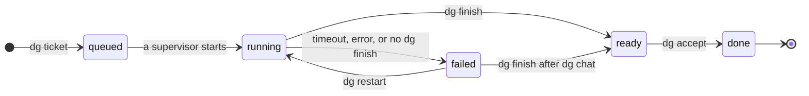

# Delegator: technical document

**Condition:** draft, for your examination
**Date:** 2026-08-17
**Product:** `delegator`, an Alcubi product. The repository is `github.com/alcubie/delegator`.
**Replaces:** the prototype at the root of this repository. Its MODE file contains
`prototype`.
**Language:** ASD-STE100 Simplified Technical English, Issue 9.

## 0. Technical names

ASD-STE100 approves 803 words. The dictionary is for aircraft maintenance data, and it
contains no words for software. This document therefore declares the technical names in
the table below. It uses each name for one thing only, in all of the text. Each name in
`code marks` is an identifier in the code, and is also a technical name.

| Technical name | What it is in this document |
|---|---|
| adapter | The code that operates one agent. |
| agent | An external command line program that writes code. Version 1 has claude only. |
| CLI | Command Line Interface. |
| commit | The one commit that a run makes. Its message is the report of the run. |
| config | The file that holds the selections of the person. |
| database | The one SQLite file that holds each field, the queue and the counter. |
| DONE | The group in the inbox that shows each ticket that the person accepted in the period that `done_hours` gives. |
| FAILED | The group in the inbox that holds each ticket whose run stopped without a report. |
| Go | The programming language of delegator. |
| goreleaser | The tool that makes the binary files and the installer. |
| inbox | The one ordered list of tickets that the person examines. |
| lock | The write lock of SQLite. It gives one writer at a time. |
| log | The output of an agent, kept in a file. |
| project | One git repository that contains work. |
| prototype | The throwaway code at the root of this repository. |
| queue | The ordered list of tickets that wait for work. |
| QUEUED | The group in the inbox that contains each ticket in the queue. |
| READY | The group in the inbox that contains each completed ticket. |
| run | One execution of an agent for one ticket. |
| RUNNING | The group in the inbox that contains the ticket with an active run. |
| schema | The version number of the format of the database. |
| session | One conversation with an agent, which the agent can continue later. |
| state | The condition of a ticket. |
| supervisor | The short program that operates one run and then stops. |
| ticket | One item of work. Its fields are a row, and its prose is a file. |
| timeout | A time limit. After the limit, the supervisor stops the run. |
| TUI | Terminal User Interface. Version 1 does not have one. |
| variables | The four items that connect a ticket to its work: the file of the prose, the worktree, the branch and the session. |
| worktree | A git worktree. |

## 1. Function of the product

Delegator gives a long task to an agent, and then tells the person when the task is
complete. The person writes a ticket, goes away, and comes back to one ordered inbox.

Delegator does one thing: it controls the queue and the isolation of the work. It does
not write code. It does not do a diff. It does not examine the work. It does not control
the configuration of an agent. Each of those tasks belongs to a program that the person
selects.

The task can be of any size, and its duration can be long. The person can be a
programmer, but this is not a condition. The only condition is a git repository.

## 2. Principles of the product

These principles come from [`../docs/RESEARCH.md`](../docs/RESEARCH.md) and from the
approved [business case](../docs/pm/business-case.md). Each decision below must obey
them.

1. **Do one thing.** Delegator controls the queue and the isolation. Other programs do
   all other work, and the person selects them.
2. **The person goes away and comes back.** The product is not a window on a run that
   operates now. Write it for a person who was away for 2 hours.
3. **The head of the person keeps no data.** The ticket file contains what to do and
   why. The agent adds a commit, and the message of that commit is its report.
4. **Show less.** The person sees the ticket, the commit and the variables. The person
   does not see the output of the agent.
5. **The inbox is one list.** All projects are in it. The person can apply a filter, but
   delegator does not apply one automatically.
6. **Closure is complete.** Each run ends with one commit, so a ticket that is ready
   always has work that a person can read.
7. **The person keeps control.** The work is on a branch, in a worktree, and the person
   selects each external command.

## 3. What the prototype taught us

The table below gives each problem and its effect on this design. Some lessons from the
prototype are no longer applicable, because this version removes the code that caused
them. Section 4 gives that list.

| # | What occurred | Effect on the design |
|---|---|---|
| 1 | The MCP server operated inside the queue worker. When the queue stopped, the agent had no tools. | Delegator has no server. The agent calls the CLI. See §5. |
| 2 | The state `processing` had two meanings. A restart put chat work back into the queue, and started the first prompt again above live work. | A run is a first class entity, and it records its initiator. See §6.1. |
| 3 | `CREATE TABLE IF NOT EXISTS` does not add new columns. A new column gave the error `no such column` on each database that existed. | A statement `CREATE TABLE IF NOT EXISTS` is not a migration. Delegator keeps a number in `PRAGMA user_version`, and applies each migration step at each start. See §7. |
| 4 | The output of the agent went into the ticket. One ticket got 13378 characters. The short note for the person got 973 characters. | The report of a run is its commit message, which delegator does not write and does not limit. The output of the agent stays in the log. See §6.4. |
| 5 | The command `git difftool` started a graphical tool, and the TUI went away until the tool stopped. | Delegator has no diff and no built-in tools. The person configures each command. See §9.2. |
| 6 | The command `queue status` used the directory of the person as a filter, and hid tickets from other projects. | One inbox contains all projects. A filter is always explicit. See principle 5. |
| 7 | The command `queue down` released the lock while a run continued. A quick restart was able to start a second worker on the same worktree. | SQLite controls the queue. A lock from the operating system cannot become out of date. See §5. |
| 8 | Only the claude adapter operated. The other three came from documentation, and no one operated them. | Version 1 has claude only. The package `adapters/` keeps the seam for later work. See §6.6. |
| 9 | No limit controlled a run. A ticket stayed in `processing` with no timeout and no cancel command. | Each run has a timeout, a cancel command and a restart command. See §6.3. |
| 10 | Each test used a real agent run. The tests were slow, expensive and not repeatable. | A fake agent with a script is a first class test fixture. See §10.2. |

## 4. Scope

**In scope for version 1**

- Tickets as Markdown files, which the person can read and change with any editor.
- One queue for all projects, with an order that the person can change.
- Work in the background, in a worktree. One run at a time.
- The inbox, with the groups DONE, READY, RUNNING, FAILED and QUEUED.
- One commit for each run, and its hash on the ticket.
- The four variables for each ticket, for use by other programs.
- The endpoint `dg rpc` for programs to call commands.
- Commands of the person, which delegator starts in a new window.
- One installer for Linux and macOS.
- The claude agent.

**Not in scope for version 1.** These items are removed from the earlier draft, or they
belong to the parent product.

- A TUI. Version 1 is a CLI, and the TUI is the next milestone. See §9.1.
- More than one run at a time. See §6.2.
- An MCP server. The agent uses the CLI. See §5.
- A database, and therefore migrations of a database. See §7.
- Measurements of the person or of the runs.
- A diff, a difftool, or any other built-in external tool. See §9.2.
- The output of the agent in the inbox, and the code that gives it a structure.
- A limit on the count of tickets in READY. Tickets collect there, as mail does.
- A `.pkg` file for macOS, and a Homebrew formula. See §12.
- A command `dg upgrade`. The installer does this work.
- Agents other than claude.
- Work in the cloud, a web interface, more than one person, or teams.

## 5. Architecture

Delegator has no server and no long-life program. This is the largest change from the
earlier draft, and it removes lesson 1 and lesson 7 completely.

```
   dg (CLI)                         claude
      │                          (calls dg)
      └────────────┬──────────────────┘
                   ▼
           ┌───────────────┐
           │ delegator.db  │   SQLite in WAL mode. One writer at a time.
           └───────┬───────┘
                   ▼
           ┌───────────────┐
           │ files on disk │   prose, worktrees, config, logs
           └───────┬───────┘
                   ▼
           ┌───────────────┐
           │ dg run [id]   │   one supervisor for each run. It claims its
           │ (supervisor)  │   own ticket, starts the agent, applies the
           └───────┬───────┘   timeout, writes the state, starts the next
                   │           ticket, and then stops.
                   ▼
             claude process ──► git worktree
```

**How the queue continues.** Each supervisor is a short program that operates apart from
its parent. When its run stops, the supervisor opens a write transaction, writes the state, and starts
the supervisor for the next ticket in the queue. The queue therefore continues after the
person closes the terminal.

**How the queue recovers.** A supervisor can stop with no report, from a crash or from a
restart of the computer. Each CLI command therefore does a reconcile in one transaction. The
reconcile finds each run with no live program, marks it `failed`, and starts the next
ticket if no run is active.

**Why there is no long-life program.** Only two functions must continue after a command
stops: the run itself, and the start of the next run. A supervisor that operates apart
does both. A long-life program adds a life to control, and lesson 7 came from exactly
that.

**Why the agent uses the CLI.** Each agent can start a program. The CLI is therefore
available to every agent, and no configuration is necessary. This removes the server, the
port, the token and the life of the server.

## 6. Main decisions

### 6.1 A run is a first class entity

A ticket has runs. Each run records the type of work, which is `initial`, `restart` or
`revision`. It also records the initiator, which is `queue` or `person`. It records the
agent, the session, the worktree, the branch, the start time, the end time and the exit
code.

A run is a row of the table `runs` in §7. The row holds the process id of the supervisor,
the start time, the end time and the exit code. The supervisor writes the row in the
transaction of its claim, so a ticket in `running` always has the process id of its
supervisor.

The reconcile in §5 reads that row to ask whether the supervisor is alive. The run is
dead if its start time is before the boot time of the computer, if the process id is
free, or if the run is older than the timeout. [`RUN_CONTROL.md`](RUN_CONTROL.md) gives
the options and the reasons. No flag for an owner is necessary, and a run from a chat is
not a special condition.

### 6.2 The limit on runs, and two orders

The config gives the limit on runs. The key `runs` in §9.2 says how many tickets can be
open at one time, and its value is 1 if the person writes no other value. A ticket in
`running` holds one slot, because a supervisor operates on it. A ticket in `ready` holds
one slot, because the person did not examine that work. A trigger starts one supervisor
for each free slot, and each supervisor claims one ticket of the queue or stops.

The key `max_runs_per_project` in §9.2 is a second limit, and it holds for each project
on its own. It counts the tickets of one project in `running` and in `ready`, the way
`runs` counts the tickets of every project together. It names no project, so the person
writes one value and each repository they add gets it. Its value is 0 if the person
writes no other value, and 0 is no limit for each project: every project then takes
`runs`.

A supervisor therefore claims the first ticket of the queue whose project has room, which
is not always the first ticket of the queue. A ticket waits while a later ticket of a
project with room starts. The inbox shows the queue in its order and says nothing about
why a ticket waits.

Two lists have two different orders. This section replaces §6.3 of the earlier draft,
which was not correct.

| List | Order | Why |
|---|---|---|
| QUEUED | The order of the queue. The person can change it. | The person controls what operates next. |
| READY | The sequence that the person set. A new ticket goes at the end. | The list is stable. The person controls what to examine next. |

The earlier draft put READY in the order of the queue. That order is not stable. A slow
ticket that entered the queue first comes into the list **above** tickets that the person
can see now. The list therefore moves below the eyes of the person. A new ticket that
goes at the end moves no row above it.

The command `dg move` changes the sequence of READY. A ticket at the end can go to the
top, and the person then examines it first. A move keeps a ticket in its own list: a
ready ticket cannot go into the queue, and a queued ticket cannot go into READY.

There is no limit on the count of tickets in READY. Tickets collect there, as mail
collects in a mail inbox. The count can be 1 or 100.

### 6.3 Limits on a run, and the restart

Each run has a timeout. The default is 60 minutes, and the config holds the value. If the
run goes above the timeout, the supervisor stops the agent, and the state becomes
`failed`.

An error can also come from outside. An example is an API that does not reply. The command
`dg restart <id>` therefore starts the run again. It continues the same session, in the
same worktree, so the agent keeps the work that it did.

The command `dg cancel <id>` stops the work on a ticket. It operates from each state that
is not the end. From `running` it stops the run and keeps the worktree. From each other
state there is no run to stop, and the ticket closes with no `dg accept`. Section 8 gives
each state.

### 6.4 The report from the agent: one commit

The agent must end its work with one commit, and then this command:

```
dg finish <id> <commit>
```

The message of that commit is the report. It says what the run did, and it names each item
that did not go as the ticket said. Delegator writes no part of it and puts no limit on
it, because the message belongs beside the code that it describes, where the person reads
the two together.

**A run that changes nothing still commits.** The agent uses `git commit --allow-empty` and
gives the reason in the message. Each run therefore makes exactly one commit, and
`git log <default>..<branch>` always shows the work of the run. A finished run with no
commit and a finished run that found nothing to do would otherwise look the same.

**A run with no change is still `ready`.** The person examines the message and decides. A
run that changed nothing can be the correct answer to a ticket, and delegator does not make
that decision.

**Delegator keeps no short note from the agent.** An earlier design gave the agent a
`result` of 160 characters and a `flags` of 240, and put a mark in the inbox for a ticket
whose `flags` were not `none`. Both are gone.

The note repeated the commit message, which the agent had already written. The mark was
worse: it came from the agent, about the work of the agent, and a person who saw no mark
read it as work that needs no examination. An agent that is confidently wrong writes no
flag. Section 6.4 says that a ticket which looks complete but is not complete is the most
expensive error, and a ticket that looks safe is that same error one level above. The
person reads the commit.

A run that stops before `dg finish` becomes `failed`, and not `ready`.

The full data stays available, but away from the eyes of the person. The session has the
complete conversation. The log file has the raw output.

### 6.5 The git boundary, worktrees and branches

Delegator accepts a ticket only if the directory is in a git repository. This condition
operates from version 1. It prevents work on files that no version control protects.

Each run gets one worktree, and one branch `delegator/<id>-<slug>`. The branch comes from
the default branch of the repository. At acceptance, Delegator attempts to remove a
validated worktree, but it never removes the branch. The person can therefore open the
branch later. A cleanup failure is a warning and does not reverse ticket closure.

`dg accept` first asks Git whether the ticket branch is an ancestor of `HEAD` in the
stored project checkout. If it is not, Delegator compares the stable patch of the complete
branch change with each non-merge commit in `HEAD` after the common base. An equal patch
accepts a squash merge. A partial change, or the ticket change in a commit that also holds
other work, is not equal and the ticket stays ready. The named error tells the person that
`--force` is available. An explicit ticket id can belong to a different project, so this
check never uses `HEAD` from the directory of the caller. Before committing DONE,
Delegator also asks Git for staged, unstaged, and non-ignored untracked changes. Any of
them leaves the ticket ready. `--force` bypasses both checks and permits removal of a
dirty Git worktree. An absent worktree is already cleanly removed. A remaining directory
without a `.git` entry cannot be verified, so acceptance preserves it and warns the
person to inspect it manually, including with `--force`.

### 6.6 The seam for other agents

The package `adapters/` holds one interface, and one implementation for claude. The
interface is small:

```go
type Adapter interface {
    Launch(spec RunSpec) *exec.Cmd         // headless run
    Resume(session string) []string        // argv for an interactive session
    SessionID(out []byte) (string, error)  // the session the run made
    Name() string
}
```

Each agent makes its own session id and reports it in the output of the run. Delegator
reads it from there and keeps it on the ticket, and `Resume` gives it back to the agent
later. The command `claude -p --output-format stream-json` writes one JSON object for each
event, and the first of them carries `session_id`, before any work starts. A run that stops
part way has therefore already given its id, and a person can open the session to see what
went wrong. The single-object format `json` gives the id last, which is the one line a run
that dies never writes. `claude --resume <id>` continues the conversation. The agents
codex, gemini and opencode each report the id in their output the same way.

Claude will also take an id at its start, with `claude --session-id <uuid>`, and delegator
does not use that. One path for every agent is worth more than a property that one of them
has. An earlier draft gave delegator the id and said that no code reads the output of an
agent; that was true of claude alone, and it made the seam fit one agent of four.

`RunSpec` carries a session, and it is empty for the first run of a ticket. `dg restart`
gives the next run the session of the run that failed. The adapter says how to continue
it: for claude, the argv is `claude -p --resume <id>`. Delegator still makes no id of its
own. The id that it gives back is the id that the agent made and reported through
`SessionID`. The seam therefore keeps one path for every agent.

A run that stops before it reports an id therefore has no session, and a person cannot
continue that conversation. This is the same for each agent, so the supervisor answers for
one case and not for two.

### 6.7 The history of each change of state

The table `transitions` keeps the history of each ticket. One row is one change of state.
The row holds the ticket, the status before the change, the status after the change, and
the time. The first row of each ticket is the time that the person made it, and that row
holds no status before the change. The last row gives the status that the ticket has now.

A single timestamp cannot describe every change of state. For example, restarting a
failed ticket begins another run without removing the history of its earlier failure.
Delegator writes each transition row once and does not change it again. The store writes
the row in the transaction of the change, so a change that gives an error writes no row.

A run keeps its own start time and its own end time, and the rows of `transitions` do not
replace them. Those times are facts of one run, and a ticket has one run for each claim.
The end of a run is also not always a change of state. `dg finish` makes a ticket ready,
and the supervisor ends the run after that with the exit code. The two records agree,
because the writes of one time are in one transaction and take one value. The claim of a
ticket gives `runs.started_at` and the change into `running` the same value.

You cannot get this data from an earlier day, and §5 of `FEATURES.md` gives that rule. The
step that makes the table writes the two times that the database holds. Those two are the
time that the person made each ticket, and the time that a ticket became ready. The second
row goes in
for a ticket in `ready` or in `done`, because that ticket stays where the time put it. A
ticket that left `ready` has a subsequent change, and the database holds no time for it.

## 7. Data on disk

Delegator keeps the fields of each ticket in one SQLite database. It keeps the prose of
each ticket in a file. The person writes the prose with an editor, and an editor opens a
file and not a row.

```
$XDG_CONFIG_HOME/delegator/config.toml

$XDG_DATA_HOME/delegator/
  delegator.db                       the fields, the queue and the counter
  tickets/
    4.md                             the prose. The person writes this file.
  worktrees/
    4/
  cache/                              disposable data that agents may reuse
    projects/
      2/                              private cache shared by project 2's tickets
  runs/
    4/
      2026-08-17T09-30-00.log        the raw output of the agent
```

On Windows, if `XDG_CONFIG_HOME` is not set, delegator keeps `config.toml` in
`%APPDATA%\delegator`. On Windows, if `XDG_DATA_HOME` is not set, delegator
keeps the files below it in `%LOCALAPPDATA%\delegator`.

**Why a database, after lesson 3.** Lesson 3 in §3 says that `CREATE TABLE IF NOT EXISTS`
does not add a new column. That lesson is correct. Its cause was the absence of a
migration, and not the database: `CREATE TABLE IF NOT EXISTS` is not a migration.
Delegator now keeps a number in `PRAGMA user_version`. At each start it applies each
migration step above that number, in one transaction. The earlier design had no database
because of lesson 3, and this design answers the lesson directly.

The person loses one thing. A ticket is no longer a file that `cat` can show. The command
`dg rpc` with the method `show` and ticket id 4 gives the same fields, and §12 says
why a program uses that endpoint.

**Ticket ids are one sequence for all projects.** The column `id` of the table `tickets`
is an `INTEGER PRIMARY KEY`, so SQLite gives the next number. The command `dg show 4` is
therefore not ambiguous, and the inbox can show all projects together. No name on the disk
contains a project, so the name of each file below `tickets/`, `worktrees/` and `runs/` is
the id alone.

The cache below `cache/projects/<project-id>` is the exception to ticket-named data. It
survives removal of a ticket worktree so later tickets of the project can reuse artifacts,
but all of `cache/` is disposable and may be removed without losing delegator state.

The id has no zero in front of it. A name with a zero in front sorts correctly with `ls`,
but `ls -v` and `sort -V` read the number and give the same sequence from the id alone.

**The tables.**

```sql
CREATE TABLE projects (
  id             INTEGER PRIMARY KEY,
  path           TEXT NOT NULL UNIQUE,
  default_branch TEXT NOT NULL,
  first_commit   TEXT
);

CREATE TABLE tickets (
  id         INTEGER PRIMARY KEY,
  project_id INTEGER NOT NULL REFERENCES projects(id),
  title      TEXT NOT NULL,
  status     TEXT NOT NULL,
  position   INTEGER,
  branch     TEXT,
  session    TEXT,
  commit_id  TEXT,
  created    TEXT NOT NULL,
  CHECK ((status = 'queued') = (position IS NOT NULL))
);

CREATE UNIQUE INDEX tickets_position ON tickets(position);

CREATE TABLE runs (
  id         INTEGER PRIMARY KEY,
  ticket_id  INTEGER NOT NULL REFERENCES tickets(id),
  pid        INTEGER,
  started_at TEXT NOT NULL,
  ended_at   TEXT,
  exit_code  INTEGER
);
```

The column `position` is the queue. The path of a worktree is `worktrees/<id>`, so it
needs no column. The branch keeps a column, because the person can give the branch a new
name. The column is `status`, and a state is what §8 talks about: `status` is the name that
a column of a database takes.

**The queue is in the table, and not only in the code.** A ticket of the queue holds the
status `queued` and a position. Each half alone puts the ticket in no queue: a ticket with
a position and another status left the queue, and a ticket with the status `queued` and no
position is in no queue at all. The `CHECK` refuses each half, so no command of delegator
and no person with the `sqlite3` program can make one. The unique index refuses two
tickets in the same place.

A command that writes a new sequence must therefore not take each position away first,
because a queued ticket with no position is what the `CHECK` refuses, and SQLite has no
`CHECK` that waits for the commit. Each position goes below zero instead, and the new
positions go above it.

**One writer at a time.** Delegator opens the database in WAL mode, and gives it a
`busy_timeout`. Each command that writes uses `BEGIN IMMEDIATE`. Two programs that write
at the same time therefore lose no data, and a program that only reads does not wait. This
removes the file lock of the earlier design. It also keeps the answer to lesson 7. The lock
comes from the operating system, so it cannot become out of date.

**How the person changes the sequence.** The command `dg move <id> up` moves one ticket
above the ticket that is above it. The other directions are `down`, `top` and `bottom`.
Delegator reads the sequence, moves the one ticket, and writes each new position, all in
one transaction.

An earlier design put the sequence in `$EDITOR`, as `git rebase -i` does. The person can
hold that file open for a long time, and the queue can change while it is open: a
supervisor starts the first ticket, or `dg ticket` adds a ticket at the end. The file then
holds a sequence for a queue that is not there any more, and delegator must find the
difference and say so. A command that moves one ticket reads the queue at the time that it
writes it, so no such difference is possible.

**If the person moves a project.** The path of a project is a column, and no name on the
disk comes from it. Delegator therefore keeps its connection to each ticket. Only git
breaks, because the `.git` file of a worktree holds the old path of the repository.

Delegator does a check. Each command reads the path of each project. If a path is not on
the disk, delegator says so, and it makes no new project:

```
$ dg
delegator: the project at /home/person/projects/web-api is not on the disk.
           If you moved it, go to its new position and run `dg project relink`.
```

The command `dg project relink` does this work, from the new position:

1. It reads the first commit of the repository, and finds the project with the same first
   commit.
2. It writes the new path in the column `path`.
3. It does `git worktree repair` for each worktree of that project.

Delegator does not do this work automatically. A copy of a repository has the same first
commit as its source, so two projects can look the same. A command from the person is
therefore necessary. A project with no open work is not affected.

**The prose of a ticket.** The file `tickets/4.md` holds the prose only:

```markdown
Remove the staging app, the volume, the records of the DNS, the monitor and
the secrets.
```

The command `dg ticket` creates this file. The command `dg edit` can change the prose
while the ticket is queued, before an agent starts reading it for a run.

**Why the prose is not in the database.** The person owns the prose. Section 9.2 gives the
variable `{ticket}` to each command of the person, and that variable is a path. A row of a
table is not a thing that `$EDITOR` opens. The database holds each field that delegator
writes, so no command of delegator can damage the prose.

**The title.** The command `dg ticket` with no arguments opens `$EDITOR`. The first line
becomes the column `title`, and the other lines become the prose. The title is a column,
and not the first line of the prose. Delegator makes the row of the inbox and the name of
the branch from it.

**Upgrades.** The number in `PRAGMA user_version` is the complete answer to the problem of
upgrades. A new version of delegator applies each migration step that the database does
not have. If the database declares a number above the number that the program knows, the
program stops with an error. It writes nothing. A person who installs an older version
therefore loses no data.

## 8. States of a ticket

One module controls each change of state. An illegal change causes an error, and the
module does not write it.



Each change of state is in the table below.

| From | To | What causes the change |
|---|---|---|
| no ticket | `queued` | `dg ticket`. The new ticket goes at the end of the queue. |
| `queued` | `running` | No command. A supervisor takes the first ticket of the queue. |
| `running` | `ready` | `dg finish`. The agent gives the commit that its run made. |
| `running` | `failed` | The timeout, an error, or the end of a run before `dg finish`. |
| `failed` | `running` | `dg restart`. The run continues the same session, in the same worktree. |
| `failed` | `ready` | `dg finish`, after the agent completes the work interactively through `dg chat`. |
| `ready` | `done` | `dg accept`, after the ticket branch is in the project HEAD and its registered worktree is clean. Delegator then attempts to remove the worktree and keeps the branch. |
| each state that is not the end | `cancelled` | `dg cancel`. From `running` it also stops the run. |

**Only an agent gives the state `ready`.** The command `dg finish` is one of the two
commands of the agent in §9.3. A run that stops before `dg finish` becomes `failed`, and
not `ready`. Section 6.4 says why: a ticket that looks complete but is not complete is the
most expensive error.

**The state `ready` is where the person examines the work.** The command `dg accept`
closes the ticket after its branch is merged. The command `dg cancel` stops the work.
If changes are needed, the person can continue the agent session with `dg chat` or edit
the worktree directly before merging and accepting it.

**The command `dg cancel` is not in the diagram.** It operates from each state that is
not the end, so an edge from each of those states would go to `cancelled`. Those edges
show one rule, and they make the sequence of the other states less easy to see. The
table above gives the rule in one row.

**The states `done` and `cancelled` are the end.** No command changes a ticket from them,
and `dg cancel` does not operate on them.

## 9. Interfaces for the person

### 9.1 The inbox

The command `dg` gives the inbox. The groups are always in the same order, because
recognition is easier than memory.

```
$ dg
Status: Running
DONE
  2 web-api      Remove the old health check
READY
  4 web-api      Remove the staging app
  7 data-loader  Add a limit on the rate
RUNNING
  9 web-api      Move to a new version of Go               00:14:07
FAILED
 10 data-loader  Fix the query that broke the build
QUEUED
 11 data-loader  Change the tool that measures the coverage
 12 web-api      Roll out the new base image          depends on #9
```

DONE is the first group. It shows each ticket that the person accepted with
`dg accept` in the period that `done_hours` gives. The sequence is the time that
the person accepted the ticket, and the ticket that the person accepted last is
at the end. A ticket that `dg cancel` stopped is not in DONE, because a cancel
is not an acceptance.

DONE keeps the work of a day in view after the person accepts each ticket of it.
The person can read a commit again, and the group also shows what delegator
completed.

The row of a run ends with the time from its start, as HH:MM:SS. The value changes
each second, and a person who reads the inbox with `watch -n 1 dg` sees that the run
continues. The time is at the right of the row, at the width of the rule that `dg show`
puts below a title, so the times of two runs are in one column. A title that reaches
that column is cut, and an ellipsis shows where it was cut.

The row of a queued ticket that depends on another ends in the same column with
`depends on #9`, so a person who sees a ticket at the top of the queue and no run reads
one edge of the inbox for the reason. Only the tickets that are not done are named,
because those are the ones that hold the ticket back; a link that is satisfied shows
nothing. The inbox reads the links of every open ticket in one query, so the cost does
not grow with the length of the queue. A ready ticket carries no such note: READY waits
for the person and not for the queue.

FAILED sits between RUNNING and QUEUED, so a person who reads the inbox down its order
sees what is working, what stopped and what waits. It holds each ticket whose run
stopped without a report, and the sequence is the time of the failure: the ticket that
failed first is at the top, so the failure that has waited longest is the one the person
deals with first. The group is there only when it holds a ticket. An empty FAILED is the
usual condition, and a heading with no rows below it says nothing. A run that failed
while the person was away is the one thing the inbox must not hide. The heading is there
to say so, and it means something each time a person sees it.

A failed ticket is not in READY. READY is where the person examines work, and each
ticket of it holds the commit of a finished run. A failed run made no commit, so there
is nothing to examine, and the action it wants is not a review but a decision about the
run: `dg restart` or `dg cancel`. The inbox gives no mark, and a failure does not need
one: a mark would say that a ticket needs no examination, and a failure is not the claim
of an agent about its work, it is a fact that delegator observed, that the run gave no
report. A group of its own shows it without a mark.

The first line says whether the queue will start work: `Status: Running`, or
`Status: Paused` after `dg pause`. It is always there, so a person never has to know what
the absence of a line means. At a terminal the word is green or yellow; in a pipe or a
file it is plain text, so a log or a grep sees no escape code. The flag `--color` takes
`always`, `never` or `auto`, as `ls` and `grep` do, and `auto` is the default. With
`auto`, `NO_COLOR` in the environment turns the colour off and `CLICOLOR_FORCE` turns it
on for a pipe; the flag wins over both. `watch -c -n 1 dg --color=always` therefore shows
the status in colour.

The inbox gives no mark for a ticket that needs attention, and it gives no summary of a
run. Each ticket below READY waits for the same thing: a person who reads its commit. A
mark that came from the agent would say that the other tickets need no examination, and
that is the one thing delegator must not say. Section 6.4 gives the reason in full.

The command `dg show 4` gives one ticket in full:

```
$ dg show 4
  #4  Remove the staging app                                  ready
                                                             2h ago
  ─────────────────────────────────────────────────────────────────
  commit      9f3a1c2 Remove the staging app and its DNS records

  ticket      …/delegator/tickets/4.md
  worktree    …/delegator/worktrees/4
  branch      delegator/4-remove-the-staging-app
  session     e55e382e-2c88-4de7-a31d-ab8763a0fb5a
  depends on  #2 #3

  Remove the staging app, the volume, the records of the DNS, the
  monitor and the secrets.
```

The subject of the commit is on the row. `dg open diff 4` gives the change itself.

`dg show` puts the time on the line below the status: HH:MM:SS for a ticket in
`running`, the time from the completion for a ticket in `ready`, and the time of the
failure for a ticket in `failed`. The time ends where the status above it ends, so a
long title does not push it off the line. A ticket with no time gives no line, and the
rule comes below the title.

The row `depends on` names every ticket that this one is linked to, done or not, which is
where it differs from the row of the inbox. Here the person is reading the one ticket and
asking what they linked it to, and a link that is already satisfied is still a link they
can take away. A ticket with no link gives no row.

### 9.2 Commands of the person

Delegator starts no external tool of its own. The person declares each command in the
config, with the variables from §7:

```toml
terminal = "ptyxis --new-window -d {worktree} --"
timeout_minutes = 60
runs = 1
max_runs_per_project = 0
done_hours = 24

[commands.diff]
run = "git difftool -d {base}...HEAD"
window = true

[commands.edit]
run = "$EDITOR {ticket}"
window = false
```

The key `max_runs_per_project` gives the limit of one project, which §6.2 describes. The
value is 0 if the config file does not give the key, and each project then takes `runs`.

The key `done_hours` gives the period of DONE in hours. The value is 24 if the
config file does not give the key, so DONE shows the work of one day. A value of
0 makes DONE empty.

The variables are `{ticket}`, `{worktree}`, `{branch}`, `{base}`, `{session}` and
`{project}`. The variable `{ticket}` gives the path of the prose, because the person
changes the prose and not the fields. The command `dg open diff 4` starts the command with the name `diff` for
ticket 4. A command with `window = true` opens in a new terminal window.

This removes the detection of tools and of terminals from delegator. It also lets each
person keep the tools that they have now. When the TUI comes, each command also gets a
key.

The continuation of a session is not one of these commands. `dg chat [id]` in §9.3 is a
command of delegator, because delegator knows which program made the session, which
worktree it ran in, and whether a run is on it now, and the person knows none of the
three at the moment they type. The variable `{session}` stays for a command of the
person that reads a session, and no example here gives one that writes.

### 9.3 The CLI

The command is `delegator`, and `dg` is a short name for it. Both names come from the
installer.

| Command | Function |
|---|---|
| `dg ticket [title] [body]` | Add a ticket for the project of the current directory. With no arguments, it opens `$EDITOR`. The flag `--project <dir>` takes the project from another directory. The flag `--after <id>` makes the new ticket depend on that ticket, and the flag repeats: `dg ticket --after 12 --after 13 "title"` makes a ticket that depends on both. An id that names no ticket is an error and no ticket is made. The flag `--body-file <path>` reads the prose from a file, and a path of `-` reads it from the standard input, as `git commit -F` does. The prose has one source, so the flag beside a body argument is an error, and a path that names no file is an error that holds the path. Neither makes a ticket. The flag `--no-body` makes a ticket that has no prose. Without that flag, a title with no body is an error, and dg makes no ticket. The flag with a body argument, or with `--body-file`, is also an error. |
| `dg` | Show the inbox. |
| `dg list` | Show every ticket, in every status, one to a line, in the order of the ids. The row is the row of the inbox, with the status of the ticket where the inbox puts its note. The inbox holds the work of a day and drops a done ticket after the window of DONE; this list holds every ticket there has ever been. The flag `--project <dir>` narrows it to one project, and with no flag it holds the tickets of every project. A person who has no ticket gets no output and no error. |
| `dg show [id]` | Show one ticket and its variables. With no id, it shows the first ticket of READY of the project of the current directory, which is the ticket the person reviews next, and the flag `--project <dir>` takes that project from another directory. A flag `--project-only`, `--ticket-only`, `--worktree-only`, `--branch-only` or `--session-only` writes that value alone, on a line with no tilde, for another command line. With more than one of them, the first on the command line is the one that answers. |
| `dg edit <id>` | Change the title and the prose of one ticket of the queue. The flag `--editor` opens `$EDITOR` on the two as one text, in the form that `dg ticket` with no arguments takes: the title on the first line, and the prose after it. The first line goes to the column `title`, and each line below it goes to the file of prose. A caller that is not a person has the text already and no editor, so `--title <text>` sets the title alone, `--body <text>` sets the prose alone, and `--body-file <path>` reads the prose from a file, with `-` for the standard input, as it does for `dg ticket`. `--title` beside one of the two prose flags sets both. `--body` beside `--body-file` is an error, `--editor` beside any of the three is an error, and the command with no flag at all is an error that names the four. An empty title is the error that an editor with no first line gives. The command refuses a ticket that the queue does not hold, because the agent read the ticket as its run started. |
| `dg open <name> <id>` | Start a command of the person. See §9.2. |
| `dg start` and `dg pause` | Start or stop work on the queue. |
| `dg move <id> <where>` | Move one ticket in the queue, or in READY. `<where>` is `up`, `down`, `top`, `bottom`, or the id of a different ticket of the same list. |
| `dg depend <id> --after <other>` | Make a ticket that is already in the queue depend on another one, which `dg ticket --after` does as the ticket is made. The flag repeats, as it does there, and it takes a comma list. A link that is there already is not an error. The command refuses a ticket that depends on itself, and a link that would make a ring of tickets that each depend on the next, because no ticket of a ring can ever start. It refuses a ticket that is not queued, because a link holds a ticket back in the queue and nowhere else. The flag `--remove` takes a link away instead, which is the way out for a ticket that depends on one that was cancelled, and it is an error when no such link is there. The command writes nothing when it works. |
| `dg restart <id>` | Start a failed run again. See §6.3. |
| `dg cancel <id>` | Stop the work on a ticket, from each state that is not the end. |
| `dg chat [id]` | Continue the session of a ticket in this terminal. Delegator starts the agent of the run in the worktree of the ticket, and waits for it; the status of `dg` is the status of the agent. With no id it takes the first ticket of READY of the project of the current directory, and the flag `--project <dir>` takes that project from another directory. It refuses a ticket in `running`, and names the process that holds the run. It also refuses a ticket that has no session, and one whose worktree is not on disk. |
| `dg accept <id>` | Close a ticket after its branch is merged into `HEAD` in the ticket's project, and remove its worktree. An equivalent squash merge also satisfies the check. An unmerged branch or a worktree with uncommitted changes leaves the ticket ready and the worktree present. `--force` bypasses both checks, removes the worktree, and loses its uncommitted changes. |
| `dg run [id]` | The supervisor. With no id, it claims the first ticket with room, and this is how delegator starts it. With an id, it claims that ticket, and this is how a person starts one run by hand. |
| `dg project relink` | Connect a project again after a move. See §7. |
| `dg doctor` | Do a check of git, of claude, of the config and of the permissions. |
| `dg help` | Show each command and one line for it. `dg --help` and `dg <command> --help` do the same. |
| `dg completion <shell>` | Write the script that completes each command for bash, zsh, fish or powershell. |
| `dg version` | Show the version of the binary. Through `dg rpc`, its result is one object with `version` and `schema`. A build sets the version, and a build that sets none writes `dev`. |

The package `github.com/spf13/cobra` holds the tree of commands. One tree gives the
dispatch, the text of `dg help`, the completion of each shell, and the man page that
`cobra/doc` makes at a release. A command that arrives is therefore in each of them, and a
test walks the tree to say so.

A program uses `dg rpc`, not a flag on each command. Its JSON-RPC result gives the
command's document, so a different interface or a script reads data and not terminal
text. The method `inbox` gives the root command's document; `show` and `version` give
the documents of those commands. Section 12 shows why.

The `version` result of `dg rpc` writes a second value beside the version. `schema` is a
number, and it is the version of the documents that `dg rpc` writes. It goes up by one
when a key of that JSON changes its name, or changes its type, or goes away. A new key
does not change it, because a reader ignores a key that it does not know. A program that
starts `dg` reads the two values first, and then decides if it can read the data.

The agent uses two commands only, and one of them is a command of the person:

| Command | Function |
|---|---|
| `dg show <id>` | Read the ticket, with each change that came after the start. |
| `dg finish <id> <commit>` | End the work. See §6.4. |

An earlier draft gave the agent its own `dg read`. The agent and the person then read
the ticket through two commands, and the two can say different things: the first draft of
`dg read` gave the prose alone, and the title of a ticket is a column and not the first
line of the prose, so the agent could not see the one line that says what to do. A person
who then examines the work with `dg show` reads a ticket that the agent never got.

One command removes that risk completely. The text that `dg show` makes needs no change
for an agent: the prose goes out as the person wrote it, and each line of the ticket has
two spaces in front of it, which an agent reads as well as a person does.

## 10. How to prevent errors

You do not want a long sequence of new errors after each correction. This section shows
how to prevent them.

### 10.1 Types and limits

Go gives types at compilation. Each change of state is in one module, and an illegal
change causes an error. Delegator writes no part of the report of a run, so it applies no
limit to one: the report is a commit message.

### 10.2 The fake agent

A program `dg-fake-agent` reads a script, and does what the script says. It can write
files, call `dg finish`, stop with an error, stop with no output, and continue past the
timeout.

This decision has the largest effect in this document. It makes the queue, the supervisor,
the reconcile and the inbox testable. The tests are repeatable, they operate in seconds,
and they have no cost. In the prototype each of these parts used a real agent run, and
this is why the person found the errors.

### 10.3 Levels of tests

| Level | What it examines | Speed |
|---|---|---|
| Unit | States, the order of lists, the limits, the format of a ticket | milliseconds |
| Golden | The ticket file format, for each schema version | milliseconds |
| Integration | The CLI with the fake agent: complete lives, the reconcile after a crash, the queue order | seconds |
| Complete system | One real claude run | minutes. Marked. Not on each commit. |

For each error that a person reports, write a test at the lowest level that finds it. Give
the date and the symptom. Do this before the correction goes in.

## 11. Security

- Delegator has no inbound server, listening port or authentication token. With
  explicit consent, it makes bounded outbound requests to the telemetry collector;
  the [privacy notice](../PRIVACY.md) describes the fields and controls.
- The agent operates with its permission questions off. The area of effect is the
  worktree, and all data that the agent can get to. A worktree gives isolation, but it is
  not a sandbox. This document says so directly, and version 1 does not pretend to have a
  sandbox.
- Delegator keeps no credentials. The agent keeps its own.
- A ticket can contain private data. The database and the prose stay in the data directory
  of the person, outside each git repository, so a commit cannot send them away.
- Delegator writes each file with the permission 0600, and each directory with the
  permission 0700. Only the person who made the data can read it. This applies to each file
  in §7: `delegator.db`, the prose of each ticket, each project cache, and each log.

## 12. Repository, tools and installation

```
github.com/alcubie/delegator
  cmd/
    dg/              the binary. It reads the arguments and calls internal/cli.
  internal/
    store/           the database, the migration, the queue, the reconcile
    project/         git: the root, the default branch, the first commit
    run/             the supervisor, the timeout, the worktree
    adapters/        the interface for an agent, and claude
    config/          the config and the commands of the person
    inbox/           the groups and their order. It gives data, and not text.
    cli/             the commands, and the text for a terminal
  test/              unit, golden, integration, complete system
  docs/              this document and the decision records
```

The library for SQLite is `modernc.org/sqlite`. It is a translation of SQLite into Go, so
it needs no cgo. A build with cgo needs a C compiler for each target of goreleaser, and
`CGO_ENABLED=0` gives one static binary for Linux and macOS.

**Where a new interface goes.** The package `inbox/` gives a data structure. It does not
know which interface shows the data, and it writes no text. The package `cli/` makes the
text for a terminal from that structure. This boundary is the cause of two packages, and not
one.

A TUI therefore becomes `internal/tui/`. It reads the same structure from `inbox/`, and it
stays inside the binary `dg`, as the command `dg --watch`.

A GUI in Go becomes a second binary `cmd/dg-gui/`. A graphical library is large, and the
binary `dg` must stay small. A GUI in a different language uses `dg rpc`, and no Go
code is necessary for it.

**Go.** Go gives one binary with no other program below it. The person installs no other
item. No Go library is necessary on the computer of the person, because the compiler puts
each library inside the binary. Go is also good at the control of programs that operate at
the same time, which is the main work of the supervisor.

**Installation.** goreleaser makes the binary for Linux and macOS, for x86-64 and for
arm64. The [privacy notice](../PRIVACY.md) describes the installer and telemetry
network requests and the data handling of Delegator and its agents. One command installs
it:

```
curl -fsSL https://alcubi.ai/delegator/install.sh | sh
```

The same command gets a new version later. Version 1 has no `.pkg` file and no Homebrew
formula, because this command operates on both Linux and macOS.

## 13. Milestones

Each milestone uses the fake agent, includes tests, and is usable at its end.

1. **The database and the queue.** The tables, the migration, the queue, the reconcile, and
   the commands `ticket`, `dg` and `show`. Also the check for a moved project, and
   `dg project relink`. No agent.
2. **Work.** The supervisor, the worktree, the git boundary, the timeout, `start`,
   `pause`, `cancel` and `restart`. The claude adapter. The commands `read` and `finish`,
   with their limits.
3. **Closure.** The command `accept`, best-effort removal of a worktree, and the
   commit of each run on the ticket.
4. **Commands of the person.** The config, the variables, `dg open` and the new window.
5. **Installation.** goreleaser, the installer for Linux and macOS, and `dg doctor`.

Milestone 1 and milestone 2 have the longest duration. Each milestone after them adds to
the system.

The TUI is the first milestone after version 1. Section 9.2 keeps its place: each command
of the person also gets a key.

## 14. How we will work

You examine each commit while we build. Each commit is therefore small, and it does one
thing. Each commit message says what changed and why. A commit that corrects an error
that you reported also contains its test.

## 15. Names

The full product name is **Alcubi Delegator**, its command is `dg`, and its trade
brand is **Alcubi**. Delegator is shorthand for the product when the context is
clear.

| Item | Value |
|---|---|
| Brand and documentation | Alcubi |
| Canonical domain | `alcubi.ai` |
| Installer | `https://alcubi.ai/delegator/install.sh` |
| Repository | `github.com/alcubie/delegator` |
| Display name of the group on GitHub | Alcubi |
| Domains that go to the canonical domain | `alcubi.com`, `alcubie.com` |

The name `alcubi` was not available for a group on GitHub, so the slug in the URL is
`alcubie`. GitHub keeps the display name of a group apart from the slug, so the page reads
Alcubi. The same condition exists for flyctl: the installer comes from `fly.io`, and the
code is at `github.com/superfly/flyctl`.

The installation page must give a link to the repository. A person who sends a script from
`alcubi.ai` to a shell can then see that the two names belong to one group.

## 16. Questions for you

Each question from the earlier draft now has an answer:

- The path of a project is a column, and §7 gives the behaviour after a move.
- Ticket ids are one sequence for all projects.
- The report of a run is its commit message, and delegator applies no limit to it.
- The names are in §15.
